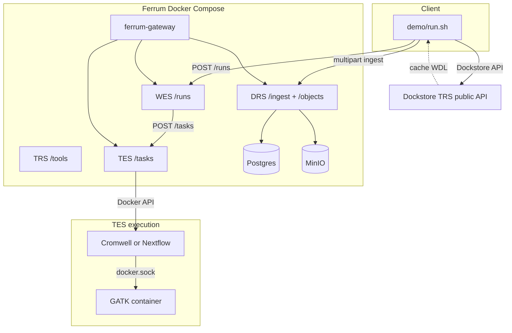

# Architecture

Technical reference for this demo. **Operator entry:** [README](../README.md) (`./run`, env vars). **Last metrics:** [benchmark.md](./benchmark.md) (auto-generated).

## Demo scope (phases)

| # | What | Run |
|---|------|-----|
| 1 | DRS `/stream` micro-timing (plain; optional client header) | Every pass; `./run --crypt4gh` + `FERRUM_GA4GH_CRYPT4GH_PUBKEY` (PEM → single-line base64 in script) |
| 2 | Macro: plain vs Crypt4GH-at-rest ingest + **dual DRS micro** (`ref_fasta` plain oid vs encrypted oid) | `./run --macro` or `./run --nextflow --macro` |
| 3 | Nextflow same slice as WDL | `./run --nextflow` |
| 4 | Docs / `./run --help` / CI smoke | Done |

**`./run --no-reset`** sets `FERRUM_GA4GH_RESET_VOLUMES=0` and skips `compose down -v`. Faster iteration, but **`ferrum-init` migrations** can conflict with an existing DB. If init fails, run a **full** `./run` without `--no-reset`.

## Data plane

1. **Data** — `scripts/fetch_giab_subset.sh` + `demo/config.yaml` (GRCh37 chr22 window; synthetic fallback).
2. **Static HTTP** — `python3 -m http.server` serves `workflows/tiny_hc.{wdl,nf}` via `host.docker.internal` (+ `host-gateway` on Linux).
3. **DRS** — `POST .../ingest/file`; engines localize `GET .../objects/{id}/stream` on the compose network.
4. **DRS micro** — `scripts/drs_micro_benchmark.py` → `results/drs_micro.json`. After `./run --macro`, the script re-runs with `--encrypted-object-id` so `crypt4gh_at_rest` compares server-side decrypt timing vs plaintext `ref_fasta`. Optional `X-Crypt4GH-Public-Key` (PEM ok) for experiments; gateway re-wrap needs Passport auth in stock Ferrum.
5. **WES → TES (WDL)** — Cromwell + `inputs.json` under `{FERRUM_WES_TES_WORK_HOST_PREFIX}/{run_id}` (same path on host and in the task container). Stock Ferrum env: `FERRUM_WES_TES_WDL_BASH_LAUNCH`, `FERRUM_WES_TES_WORK_HOST_PREFIX` (see [Ferrum TES-DOCKER-BACKEND](https://github.com/SynapticFour/Ferrum/blob/main/docs/TES-DOCKER-BACKEND.md)). TES Docker: `FERRUM_TES_DOCKER_MOUNT_SOCKET`, `FERRUM_TES_DOCKER_CLI_HOST_PATH` + static Linux `docker` (`scripts/ensure_docker_cli_static.sh`).
6. **WES → TES (Nextflow)** — `params.json`, `curl` → `workflow.nf`, `nextflow.config` with `docker { enabled = true }`, then `nextflow run workflow.nf` (no bare `-with-docker`; NF 24+). Image `nextflow/nextflow:24.10.3`.
7. **Nested GATK** — `docker.sock` + `broadinstitute/gatk:4.4.0.0`.

## Phase 2 macro (Crypt4GH at rest)

`FERRUM_GA4GH_MACRO_COMPARE=1` or `./run --macro`: two passes on one stack — plaintext ingest, then `encrypt=true` using keys in `demo/fixtures/crypt4gh-node/`. Saves `results/drs_mapping_phase_plain.json`, then merges DRS micro into one `drs_micro.json` with both `plain` and `crypt4gh_at_rest`. WDL or Nextflow. Outputs: `results/phase2_pass_*.json`, `metrics.json` → `phase2_macro`. hap.py checks scientific equivalence, not byte-identical VCF.

## Resource planning (order-of-magnitude)

| Profile | RAM | Disk | Transfer (first run) |
|---------|-----|------|----------------------|
| **Current subset** | 8–12 GB host | ~5–15 GB | ~1–5 GB |
| **`./run --macro`** | same | + MinIO objects | ~2× pipeline time |
| **`./run --nextflow`** | same | + Nextflow image pull | amd64 image; on **arm64** demo sets `FERRUM_TES_DOCKER_PLATFORM=linux/amd64` |
| **Full GIAB-style WGS** (not implemented; `./run --giab-full`) | 32–64 GB+ | 200 GB–1 TB+ | 50–200 GB+ |

Crypt4GH: DRS micro (macro) = plaintext stream vs at-rest ciphertext + **server decrypt** on `/stream`; optional client-header timing if `FERRUM_GA4GH_CRYPT4GH_PUBKEY` is set. Macro adds extra gateway CPU; MinIO I/O is on the Docker network, not “internet”.

Extra clone path: `FERUM_SRC` (`.cache/ferrum`) — second checkout only if you build separately.

## Patch overlay (demo)

`vendor/ferrum-overlay/` is rsync’d onto `.cache/ferrum` before `docker compose build`. It is intentionally small:

- **`ferrum-gateway` `main.rs`** — reads **`FERRUM_TES_BACKEND`** / **`FERRUM_TES_WORK_DIR`** (stock binary still defaults to noop TES until this lands upstream).
- **`ferrum-wes` `executors/tes.rs`** — thin delta on upstream: per-run **`workdir`** when **`FERRUM_WES_TES_WORK_HOST_PREFIX`** + bash/file launch modes are on; pinned Cromwell / Nextflow images; multi-line `nextflow.config` for NF 24+.

Everything else (Docker TES executor, compose **`FERRUM_GATEWAY_FEATURES=tes-docker`**, **`FERRUM_TES_DOCKER_*`**, **`FERRUM_WES_TES_*`**) follows [Ferrum](https://github.com/SynapticFour/Ferrum) as documented. Conformance runner: [HelixTest](https://github.com/SynapticFour/HelixTest). Deployment / lab on-ramp: [Ferrum-Lab-Kit](https://github.com/SynapticFour/Ferrum-Lab-Kit).

`demo/run.sh` runs **`git checkout`** on paths we no longer overlay so stale patches in `.cache/ferrum` are dropped. DRS is **not** patched.

**Host vs container paths:** `demo/run.sh` sets **`FERUM_WES_WORK_HOST`** to **`$REPO/results/wes-work`** (absolute), passed into compose as **`FERRUM_WES_TES_WORK_HOST_PREFIX`**. Custom bind: **`FERRUM_GA4GH_WES_HOST_OVERRIDE`** (absolute path on the Docker host).

## Benchmark (hap.py)

`benchmark/Dockerfile.happy` — linux/amd64 micromamba, hap.py + rtg-tools. `benchmark/run_happy.sh` → `results/benchmark.json`.

Auto-generated **[docs/benchmark.md](./benchmark.md)** also includes **Publication-friendly summary**: DRS micro **n**, on-disk **BAM / ingest totals** (`scripts/dataset_profile.py` → `results/dataset_profile.json`), and **Cromwell vs Nextflow** timings (`demo/lib/update_engine_compare.py` merges each run into `results/engine_compare.json`). Run **`./run`** and **`./run --nextflow`** to fill both engine rows; files under `results/` are gitignored but the markdown is committed after each local run.
