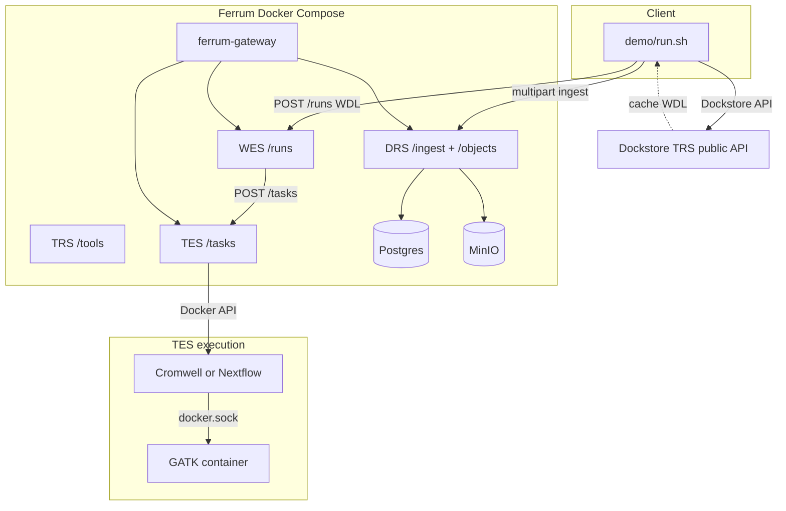

# Architecture

## Data plane

1. **Reference + reads + truth** — `scripts/fetch_giab_subset.sh` downloads a **GRCh37** window on **chr22** from public Platinum / GIAB / 1000G endpoints (see `demo/config.yaml`).
2. **Static HTTP** — `python3 -m http.server` exposes `workflows/tiny_hc.wdl` or `tiny_hc.nf` using `host.docker.internal` (plus `host-gateway` extra_hosts on Linux).
3. **DRS** — Local files are uploaded with `POST /ga4gh/drs/v1/ingest/file`. Engines localize **`GET /ga4gh/drs/v1/objects/{id}/stream`** URLs (`http://ferrum-gateway:8080/...`) on the compose network.
4. **DRS micro-benchmark** — After ingest, `scripts/drs_micro_benchmark.py` measures wall time for streaming a reference object (default first ~8 MiB), plain and optionally with **`X-Crypt4GH-Public-Key`** (`FERRUM_GA4GH_CRYPT4GH_PUBKEY`). Results merge into `results/metrics.json` as `drs_micro`.
5. **WES → TES (WDL)** — TES task runs **Cromwell** with `inputs.json` under **`FERRUM_WES_WORK_HOST/{run_id}`**, bind-mounted at the **same absolute host path** inside the Cromwell container (nested `docker run -v` resolves on the host). **FERRUM_TES_EXTRA_BINDS** adds `docker.sock` and a static **Linux `docker` CLI** (`scripts/ensure_docker_cli_static.sh`).
6. **WES → TES (Nextflow)** — Same bind-mount pattern: `params.json`, fetched `workflow.nf`, minimal **`nextflow.config`** (`docker { enabled = true }`), then **`nextflow run workflow.nf`** from **nextflow/nextflow**; processes use `container 'broadinstitute/gatk:4.4.0.0'`.
7. **Nested GATK** — Cromwell `runtime { docker: … }` or Nextflow with **Docker enabled** spawns **broadinstitute/gatk** via **docker.sock**.

## Phase 2 macro (Crypt4GH at rest)

Set **`FERRUM_GA4GH_MACRO_COMPARE=1`** or **`./run --macro`** to run **two** full passes on the **same** stack: (1) plaintext multipart ingest, (2) **`encrypt=true`** ingest using the node keypair in **`demo/fixtures/crypt4gh-node/`** (mounted into the gateway). Works with **WDL** (default) or **Nextflow** (`./run --nextflow --macro`). The workflow engine still localizes inputs via **`GET .../stream`**; Ferrum decrypts at rest when `storage_references.is_encrypted` is true. Metrics land in **`results/phase2_pass_plain.json`**, **`phase2_pass_crypt4gh.json`**, and **`metrics.json`** → `phase2_macro`. **hap.py** scores are compared for scientific equivalence (not bit-identical VCF).

## Patch overlay

Files under `vendor/ferrum-overlay/` are rsync’d onto a shallow **Ferrum** clone in `.cache/ferrum` before `docker compose build`. Upstream **gateway** already merges **`FERRUM_STORAGE__*`** into DRS storage config (MinIO / S3). The overlay adds:

- **`FERRUM_TES_BACKEND`** / **`FERRUM_TES_WORK_DIR`** passed into gateway startup (default **`noop`** if unset — HelixTest / CI).
- **WES→TES** special-cases for **WDL** and **Nextflow** when **`FERRUM_WES_WORK_HOST`** is set (bind mount run dir, Cromwell or Nextflow entrypoint).
- **TES Docker executor**: extra binds (**`FERRUM_TES_EXTRA_BINDS`**), compose **network_mode**, **extra_hosts**, optional **`FERRUM_TES_DOCKER_PLATFORM`** (e.g. **`linux/amd64`** on Apple Silicon for **nextflow/nextflow**), **entrypoint/cmd** split for `bash -lc` wrappers, **`Dockerfile.gateway`** builds with **`--features tes-docker`**.

`demo/run.sh` runs **`git checkout HEAD -- crates/ferrum-drs/src/repo.rs`** after rsync so older clones are not stuck on a removed DRS overlay file.

## Benchmark

`benchmark/Dockerfile.happy` builds a **linux/amd64** **micromamba** image with **hap.py** (0.3.15) and **rtg-tools** (vcfeval). `benchmark/run_happy.sh` compares `results/query.vcf.gz` to `data/truth_slice.vcf.gz` inside the confident **BED** subset and writes `results/benchmark.json` from `results/happy.metrics.json.gz`.
