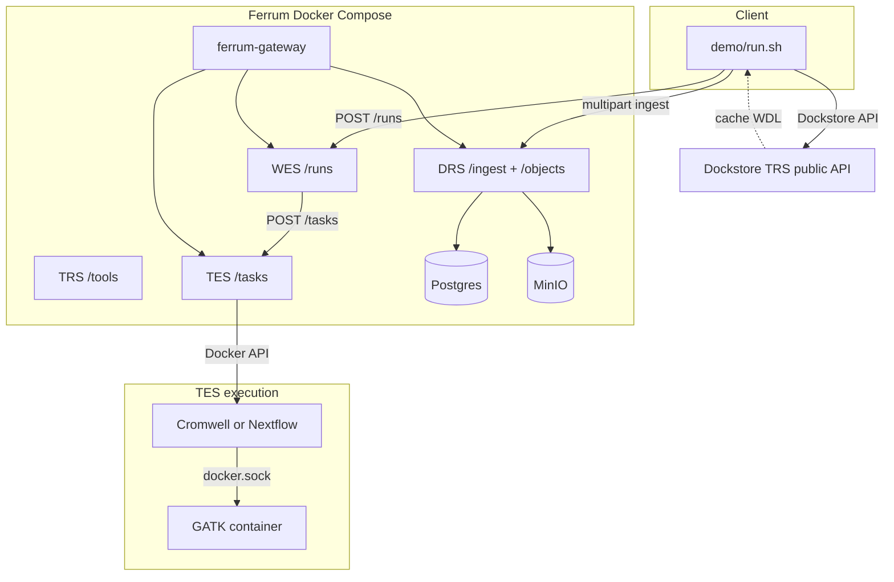
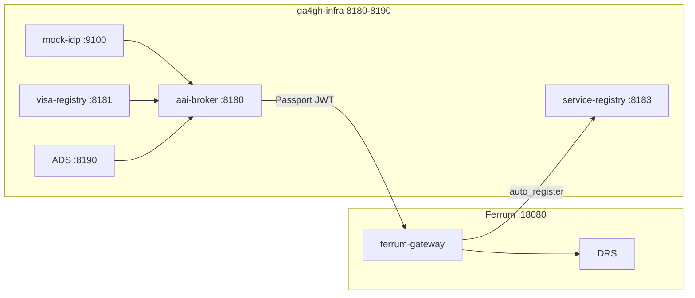

# Architecture

Technical reference for this demo. **Operator entry:** [README](../README.md) (`./run`, env vars). **Last metrics:** [benchmark.md](./benchmark.md) (auto-generated).

## Demo scope (phases)

| # | What | Run |
|---|------|-----|
| 1 | DRS `/stream` micro-timing (plain; optional client header) | Every pass; `./run --crypt4gh` + `FERRUM_GA4GH_CRYPT4GH_PUBKEY` (PEM → single-line base64 in script) |
| 2 | Macro: plain vs Crypt4GH-at-rest ingest + **dual DRS micro** (`ref_fasta` plain oid vs encrypted oid) | `./run --macro` or `./run --nextflow --macro` |
| 3 | Nextflow same slice as WDL | `./run --nextflow` |
| 4 | Docs / `./run --help` / CI smoke | Done |

**`./run --no-reset`** sets `FERRUM_GA4GH_RESET_VOLUMES=0` and skips `compose down -v`. Faster iteration, but **`ferrum-init` migrations** can conflict with an existing DB. If init fails, run a **full** `./run` without `--no-reset`.



## Data plane

1. **Data** — `scripts/fetch_giab_subset.sh` + `demo/config.yaml` (GRCh37 chr22 window; synthetic fallback).
2. **Static HTTP** — `python3 -m http.server` serves `workflows/tiny_hc.{wdl,nf}` via `host.docker.internal` (+ `host-gateway` on Linux).
3. **DRS** — `POST .../ingest/file`; WES payload carries a DRS-first marker (`input_drs_uri`) and engines localize per-file `GET .../objects/{id}/stream` inputs on the compose network.
4. **DRS micro** — `scripts/drs_micro_benchmark.py` → `results/drs_micro.json`. After `./run --macro`, the script re-runs with `--encrypted-object-id` so `crypt4gh_at_rest` compares server-side decrypt timing vs plaintext `ref_fasta`. Optional `X-Crypt4GH-Public-Key` (PEM ok) for experiments; gateway re-wrap needs Passport auth in stock Ferrum.
5. **WES → TES (WDL)** — Cromwell + `inputs.json` under `{FERRUM_WES_TES_WORK_HOST_PREFIX}/{run_id}` (same path on host and in the task container). Stock Ferrum env: `FERRUM_WES_TES_WDL_BASH_LAUNCH`, `FERRUM_WES_TES_WORK_HOST_PREFIX` (see [Ferrum TES-DOCKER-BACKEND](https://github.com/SynapticFour/Ferrum/blob/main/docs/TES-DOCKER-BACKEND.md)). TES Docker: `FERRUM_TES_DOCKER_MOUNT_SOCKET`, `FERRUM_TES_DOCKER_CLI_HOST_PATH` + static Linux `docker` (`scripts/ensure_docker_cli_static.sh`).
6. **WES → TES (Nextflow)** — `params.json`, `curl` → `workflow.nf`, `nextflow.config` with `docker { enabled = true }`, then `nextflow run workflow.nf` (no bare `-with-docker`; NF 24+). Image `nextflow/nextflow:24.10.3`.
7. **Nested GATK** — `docker.sock` + `broadinstitute/gatk:4.4.0.0`.

## Phase 2 macro (Crypt4GH at rest)

`FERRUM_GA4GH_MACRO_COMPARE=1` or `./run --macro`: two passes on one stack — plaintext ingest, then `encrypt=true` using keys in `demo/fixtures/crypt4gh-node/`. Saves `results/drs_mapping_phase_plain.json`, then merges DRS micro into one `drs_micro.json` with both `plain` and `crypt4gh_at_rest`. WDL or Nextflow. Outputs: `results/phase2_pass_*.json`, `metrics.json` → `phase2_macro`. hap.py checks scientific equivalence, not byte-identical VCF.

## Resource planning (order-of-magnitude)

| Profile | RAM | Disk | Transfer (first run) |
|---------|-----|------|----------------------|
| **Current subset** | 8–12 GB host | ~5–15 GB | ~1–5 GB |
| **`./run --macro`** | same | + MinIO objects | ~2× pipeline time |
| **`./run --nextflow`** | same | + Nextflow image pull | amd64 image; on **arm64** demo sets `FERRUM_TES_DOCKER_PLATFORM=linux/amd64` |
| **Full GIAB-style WGS** (not implemented; `./run --giab-full`) | 32–64 GB+ | 200 GB–1 TB+ | 50–200 GB+ |

Crypt4GH: DRS micro (macro) = plaintext stream vs at-rest ciphertext + **server decrypt** on `/stream`; optional client-header timing if `FERRUM_GA4GH_CRYPT4GH_PUBKEY` is set. Macro adds extra gateway CPU; MinIO I/O is on the Docker network, not “internet”.

### `results/drs_micro.json` (merged after `./run --macro`)

| Field | Meaning |
|-------|---------|
| `plain` | Timings for `GET .../stream` on **plaintext** `ref_fasta` (current pass or plain-phase id). |
| `crypt4gh_at_rest` | Timings for **encrypted-at-rest** `ref_fasta` (second object id); Ferrum **decrypts while streaming**. |
| `crypt4gh` | Optional: same plain URL with `X-Crypt4GH-Public-Key` (PEM file is reduced to **one-line base64** in `scripts/drs_micro_benchmark.py`). |
| `encrypted_object_id` | DRS id of the at-rest `ref_fasta` leg (paired with plain id from `results/drs_mapping_phase_plain.json`). |

Single `./run` (no `--macro`): only the **current** ingest’s `ref_fasta` is timed under `plain`; `crypt4gh_at_rest` is absent unless you pass `--encrypted-object-id` manually. Full reviewer-facing tables: [benchmark.md → Publication-friendly summary](./benchmark.md#publication-friendly-summary).

Extra clone path: `FERUM_SRC` (`.cache/ferrum`) — second checkout only if you build separately.

## Patch overlay (demo)

`vendor/ferrum-overlay/` is rsync’d onto `.cache/ferrum` before `docker compose build`. It is intentionally small:

- **`ferrum-gateway` `main.rs`** — reads **`FERRUM_TES_BACKEND`** / **`FERRUM_TES_WORK_DIR`** (stock binary still defaults to noop TES until this lands upstream).
- **`ferrum-wes` `executors/tes.rs`** — thin delta on upstream: per-run **`workdir`** when **`FERRUM_WES_TES_WORK_HOST_PREFIX`** + bash/file launch modes are on; pinned Cromwell / Nextflow images; multi-line `nextflow.config` for NF 24+.

Everything else (Docker TES executor, compose **`FERRUM_GATEWAY_FEATURES=tes-docker`**, **`FERRUM_TES_DOCKER_*`**, **`FERRUM_WES_TES_*`**) follows [Ferrum](https://github.com/SynapticFour/Ferrum) as documented. Conformance runner: [HelixTest](https://github.com/SynapticFour/HelixTest). Deployment / lab on-ramp: [Ferrum-Lab-Kit](https://github.com/SynapticFour/Ferrum-Lab-Kit).

## Village Network simulation (field / edge)

Two Ferrum gateways on an **internal Docker network** simulate two village labs (Kisumu + Nouna) with **federated Beacon** and a **netem sidecar** (1 Mbit/s, ~200 ms latency). Host ports **18081** / **18082** expose each node for curl and `demo/lib/africa_scenarios.py` ingest.

| Path | Role |
|------|------|
| `demo/scenarios/village-network/docker-compose.village.yml` | Two-node compose + network shaper |
| `demo/scenarios/village-network/run-village-demo.sh` | Full demo: ingest, federated query, resilience, audit |
| `demo/lib/africa_scenarios.py` | Synthetic ONT/pathogen ingest per node |
| `demo/lib/africa_feature_detect.py` | Probe gateway for Africa/federation flags |

**Simulation-first, then hardware:** validate federation and residency flows on a laptop before shipping Raspberry Pi kits. Physical install: `demo/scenarios/raspberry-pi/install-ferrum-edge.sh` (standalone) or Ferrum-Lab-Kit [`install-edge.sh`](https://github.com/SynapticFour/Ferrum-Lab-Kit/blob/main/install-edge.sh) (`field-edge` profile + compose merge). `FERRUM_AFRICA__*` and `FERRUM_FEDERATION__*` env vars are **ignored by stock Ferrum** until Africa Cursor Prompts land upstream.

```mermaid
flowchart LR
  subgraph VillageNet[village-net internal]
    K[ferrum-kisumu]
    N[ferrum-nouna]
    S[network-shaper netem]
    K <-->|1 Mbit/s| N
    S --- VillageNet
  end
  H[Host laptop] -->|18081| K
  H -->|18082| N
```

`demo/run.sh` runs **`git checkout`** on paths we no longer overlay so stale patches in `.cache/ferrum` are dropped. DRS is **not** patched.

**Host vs container paths:** `demo/run.sh` sets **`FERUM_WES_WORK_HOST`** to **`$REPO/results/wes-work`** (absolute), passed into compose as **`FERRUM_WES_TES_WORK_HOST_PREFIX`**. Custom bind: **`FERRUM_GA4GH_WES_HOST_OVERRIDE`** (absolute path on the Docker host).

## Benchmark (hap.py)

`benchmark/Dockerfile.happy` — linux/amd64 micromamba, hap.py + rtg-tools. `benchmark/run_happy.sh` → `results/benchmark.json`.

Auto-generated **[docs/benchmark.md](./benchmark.md)** includes the main metrics table (plain / **Crypt4GH at-rest** / optional **client header** medians when present), **Publication-friendly summary** with a **DRS micro JSON keys** table and median rows, DRS micro **n**, on-disk **BAM / ingest totals** (`scripts/dataset_profile.py` → `results/dataset_profile.json`), **Cromwell vs Nextflow** (`demo/lib/update_engine_compare.py` → `results/engine_compare.json`), and **Africa resilience features** (from `results/africa_results.json`). Run **`./run`**, **`./run --nextflow`**, and **`./run --macro`** to populate engine compare and merged DRS micro; `results/` is gitignored but the markdown is often committed after local runs.

## Africa feature detection

After the standard GA4GH benchmark completes, `demo/run.sh` probes the running
Ferrum gateway via `demo/lib/africa_feature_detect.py` to determine which
Africa resilience features are available in the current Ferrum build.

The probe is non-destructive and non-blocking. Scenarios run via
`demo/lib/africa_scenarios.py` in the same process. Results are written to
`results/africa_results.json` and merged into `results/metrics.json`.

The `./run --africa` flag additionally applies `demo/docker-compose.africa.yml`
which configures Africa-specific Ferrum environment variables. These are ignored
by Ferrum builds that do not implement the Africa features.

**Invariant:** `./run` (without `--africa`) produces identical results regardless
of which Africa features are or are not present in the Ferrum build.

## Co-deploy with ga4gh-infra

`./run --with-infra` starts **ga4gh-infra** alongside Ferrum in one Docker Compose
project. Infra listens on a dedicated port block (**8180–8190**, **9100**) so it
does not clash with Ferrum’s gateway (**18080** by default).

| Port | Service |
|------|---------|
| 8180 | aai-broker |
| 8181 | visa-registry |
| 8182 | duo-service |
| 8183 | service-registry |
| 8190 | access-decision-service (ADS) |
| 9100 | mock-idp (OIDC upstream for broker login demos) |

| Path | Role |
|------|------|
| `demo/docker-compose.ga4gh-infra.yml` | ga4gh-infra SQLite stack (co-deploy ports) |
| `demo/docker-compose.co-deploy.yml` | Ferrum external auth + service-registry discovery |
| `demo/config/ga4gh-infra/*.toml` | Co-deploy TOML (host `localhost:818x` URLs) |
| `demo/lib/infra_feature_detect.py` | Probe broker, visa-registry, service-registry, ADS |
| `demo/lib/co_deploy_scenarios.py` | Broker login → Passport → DRS; registry listing |

**Compose merge order:** `deploy/docker-compose.yml` → `demo/docker-compose.ga4gh.yml`
→ `demo/docker-compose.ga4gh-infra.yml` → `demo/docker-compose.co-deploy.yml`
→ optional `demo/docker-compose.africa.yml`.

**Ferrum env (co-deploy overlay):** `FERRUM_AUTH__MODE=external`,
`FERRUM_AUTH__ISSUER` / `FERRUM_AUTH__JWKS_URL` point at `aai-broker:8080`,
`FERRUM_SERVICES__ENABLE_PASSPORTS=false`, `FERRUM_DISCOVERY__ENABLED=true`,
`FERRUM_DISCOVERY__AUTO_REGISTER=true`. Built-in ferrum-passports are disabled;
Passports are validated via ga4gh-clearinghouse against the broker JWKS.

**Clone layout:** `demo/run.sh` clones **ga4gh-infra** to `.cache/ga4gh-infra`
(sibling of `.cache/ferrum`) so Ferrum’s path dependency on `ga4gh-clearinghouse`
resolves during `docker compose build`. Override with `GA4GH_INFRA_SRC`.

After the main benchmark, co-deploy scenarios run when infra is detected.
Results: `results/co_deploy_results.json`, merged into `results/metrics.json`.

**Invariant:** `./run` (without `--with-infra`) is unchanged. Co-deploy scenarios
are skipped with `all_passed: true` when infra is absent.


