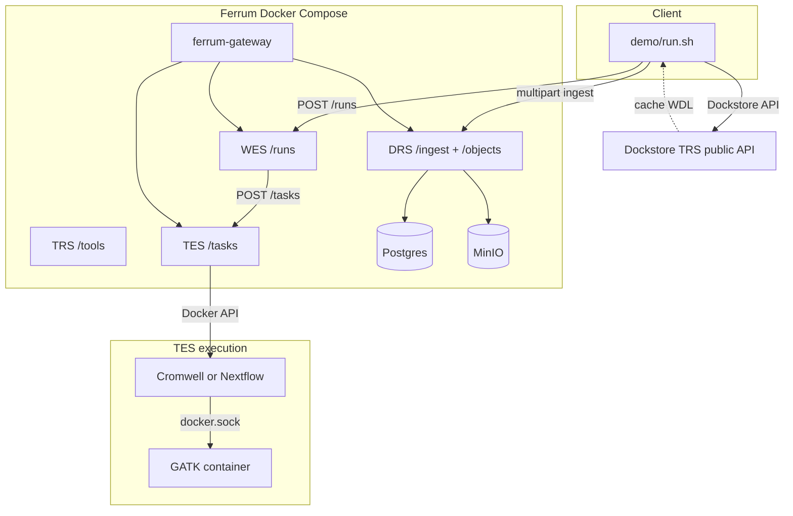

# Architecture

Technical reference for this demo. **Operator entry:** [README](../README.md) (`./run`, env vars). **Last metrics:** [benchmark.md](./benchmark.md) (auto-generated).

## Demo scope (phases)

| # | What | Run |
|---|------|-----|
| 1 | DRS `/stream` micro-timing (optional Crypt4GH client header) | Every pass; `./run --crypt4gh` + `FERRUM_GA4GH_CRYPT4GH_PUBKEY` |
| 2 | Macro: plain ingest vs Crypt4GH-at-rest | `./run --macro` or `./run --nextflow --macro` |
| 3 | Nextflow same slice as WDL | `./run --nextflow` |
| 4 | Docs / `./run --help` / CI smoke | Done |

**`./run --no-reset`** sets `FERRUM_GA4GH_RESET_VOLUMES=0` and skips `compose down -v`. Faster iteration, but **`ferrum-init` migrations** can conflict with an existing DB. If init fails, run a **full** `./run` without `--no-reset`.

## Data plane

1. **Data** — `scripts/fetch_giab_subset.sh` + `demo/config.yaml` (GRCh37 chr22 window; synthetic fallback).
2. **Static HTTP** — `python3 -m http.server` serves `workflows/tiny_hc.{wdl,nf}` via `host.docker.internal` (+ `host-gateway` on Linux).
3. **DRS** — `POST .../ingest/file`; engines localize `GET .../objects/{id}/stream` on the compose network.
4. **DRS micro** — `scripts/drs_micro_benchmark.py` → `results/drs_micro.json` (optional `X-Crypt4GH-Public-Key`).
5. **WES → TES (WDL)** — Cromwell + `inputs.json` under `FERRUM_WES_WORK_HOST/{run_id}`, bind-mounted at the **same host path** inside the Cromwell container. `FERRUM_TES_EXTRA_BINDS`: `docker.sock` + static Linux `docker` CLI (`scripts/ensure_docker_cli_static.sh`).
6. **WES → TES (Nextflow)** — `params.json`, `curl` → `workflow.nf`, `nextflow.config` with `docker { enabled = true }`, then `nextflow run workflow.nf` (no bare `-with-docker`; NF 24+). Image `nextflow/nextflow:24.10.3`.
7. **Nested GATK** — `docker.sock` + `broadinstitute/gatk:4.4.0.0`.

## Phase 2 macro (Crypt4GH at rest)

`FERRUM_GA4GH_MACRO_COMPARE=1` or `./run --macro`: two passes on one stack — plaintext ingest, then `encrypt=true` using keys in `demo/fixtures/crypt4gh-node/`. WDL or Nextflow. Outputs: `results/phase2_pass_*.json`, `metrics.json` → `phase2_macro`. hap.py checks scientific equivalence, not byte-identical VCF.

## Resource planning (order-of-magnitude)

| Profile | RAM | Disk | Transfer (first run) |
|---------|-----|------|----------------------|
| **Current subset** | 8–12 GB host | ~5–15 GB | ~1–5 GB |
| **`./run --macro`** | same | + MinIO objects | ~2× pipeline time |
| **`./run --nextflow`** | same | + Nextflow image pull | amd64 image; on **arm64** demo sets `FERRUM_TES_DOCKER_PLATFORM=linux/amd64` |
| **Full GIAB-style WGS** (not implemented; `./run --giab-full`) | 32–64 GB+ | 200 GB–1 TB+ | 50–200 GB+ |

Crypt4GH: micro-benchmark = client header timing; macro = extra gateway CPU; MinIO I/O is on the Docker network, not “internet”.

Extra clone path: `FERUM_SRC` (`.cache/ferrum`) — second checkout only if you build separately.

## Patch overlay (demo)

`vendor/ferrum-overlay/` is rsync’d onto `.cache/ferrum` before `docker compose build`. Stock Ferrum’s default path uses **noop TES**; this tree adds **Docker TES** (`Dockerfile.gateway` + `tes-docker`), gateway env for **`FERRUM_TES_*`**, and **WES→TES** bodies in **`ferrum-wes`** / executor tweaks in **`ferrum-tes`** (bind-mount `FERRUM_WES_WORK_HOST/{run_id}`, extra binds, network, optional **`FERRUM_TES_DOCKER_PLATFORM`**, Cromwell **`bash -lc`** entrypoint handling).

DRS is **not** patched; `demo/run.sh` may reset `crates/ferrum-drs/src/repo.rs` after rsync if an old clone had a stale overlay file.

**Host vs gateway env:** compose/host uses **`FERUM_WES_WORK_HOST`** for paths; the gateway container receives **`FERRUM_WES_WORK_HOST`** (Rust).

## Benchmark (hap.py)

`benchmark/Dockerfile.happy` — linux/amd64 micromamba, hap.py + rtg-tools. `benchmark/run_happy.sh` → `results/benchmark.json`.
